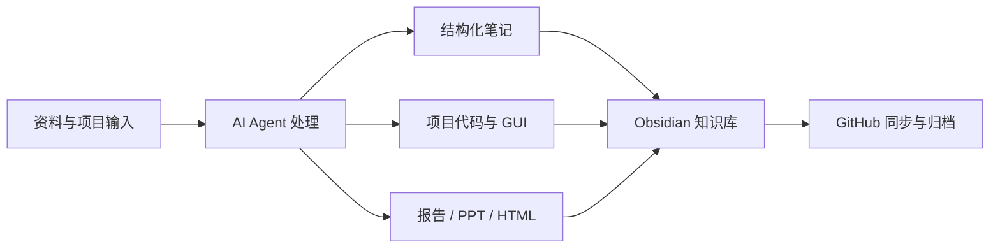

**把 AI 工具链变成稳定的学习、研究与项目交付系统**

---

## 当前定位

我是一名计算机研究生，最近的工作不是单纯“用 AI 写代码”，而是把 AI Agent、Obsidian 知识库、研究资料和项目交付流程串成一套可复用的个人工程系统。

<table>
  <tr>
    <td width="33%">
      <b>知识库工程化</b> 
      学习笔记、市场调研、项目代码、研究生组会材料统一归档，并用规则文件约束 Agent 执行流程。
    </td>
    <td width="33%">
      <b>手语无障碍原型</b> 
      围绕“中文/语音 ↔ 手语视频/识别”做双向闭环，近期重点完成桌面端 GUI 与组会汇报。
    </td>
    <td width="33%">
      <b>研究自动化</b> 
      把多源数据采集、行业横向对比、10 章报告、HTML/PDF 输出沉淀成流水线。
    </td>
  </tr>
</table>

---

## 技术栈

---

## 代表项目

| 项目 | 最近做了什么 | 技术栈 |
| --- | --- | --- |
| **xcf-personal-knowledge-base** | 搭建 Obsidian 个人知识库工程：学习笔记、市场调研、项目代码、研究生组会材料统一归档；为 Claude Code / Codex 编写多层 Agent 规范，并完成根目录说明、忽略规则和 GitHub 同步治理。 | Markdown · Obsidian · Git · Claude Code · Codex |
| **sign-language-accessibility-system** | 构建双向实时手语无障碍沟通原型：中文/语音输入 -> 真人手语视频与骨架展示；手语视频 -> 中文识别与 TTS。近期重点完成 PySide6 桌面 GUI、服务层适配、异步 Worker 和组会汇报材料。 | Python · PySide6 · OpenCV · MediaPipe · PyTorch |
| **market-research-automation** | 搭建行业研究流水线：多源市场数据采集 -> 估值/财报/资金流/技术指标/风险定价输出 -> 10 章报告 -> HTML/PDF 发布产物。 | Python · yfinance · AkShare · Playwright |
| **LangChain-RAG-FastAPI-Service** | 基于 LangChain + FastAPI 构建 RAG 知识库 API 服务，围绕向量检索和接口化知识查询做工程实践。 | Python · LangChain · FastAPI · Chroma |
| **Agent-Rag-project** | 探索多 Agent 协作、工具编排和向量检索结合的 RAG 工作流。 | Python · LangChain · Agent |

> 主知识库为私有仓库，这里只展示项目级概览。

---

## 我的工作流

---

## 最近交付

### 2026.07 - 双向手语无障碍沟通系统 GUI

- 完成一个可演示的 **PySide6 桌面端应用**：左侧中文/语音输入，中间真人手语视频与骨架同步展示，右侧上传/录制手语视频并识别回中文。
- 将 Web 端 `SignVideoApp` 封装为桌面服务层，让 GUI 可以直接调用本地能力，不需要额外启动 HTTP 服务。
- 拆分输入、候选、检索解释、舞台展示、反向识别等面板，让界面逻辑更清楚。
- 使用 Worker 处理检索、ASR、识别和视频转码，避免 GUI 主线程卡顿。
- 整理两次研究生组会最终 PPT：
  - `260701组会-手语项目-GUI界面工作版.pptx`
  - `260708组会-二分类与神经网络训练推导.pptx`

### 2026.07 - 个人知识库同步与治理

- 重新整理知识库根目录说明，明确 `01-学习`、`02-市场调研`、`04-项目`、`07-研究生` 的职责边界。
- 清理 PPT 生成过程中的临时工作区，把最终组会 PPT 迁移到 `07-研究生/组会/`。
- 将个人知识库全量同步到 GitHub，同时排除数据集、模型权重、虚拟环境、`node_modules`、缓存和 100MB+ 大文件。
- 明确 `03-GitHub/xiaochunfengbuxiao` 是独立 GitHub Profile 仓库，不混入主知识库 Git 历史。

### 2026.06-07 - AI Agent 与行业研究自动化

- 使用 Claude Code / Codex 管理素材摄入、笔记生成、图表归档、README/索引同步和 PPT 产物迁移。
- 搭建行业研究工作流，覆盖多源数据采集、行业横向对比、10 章报告、ABCDE 评级和 HTML/PDF 发布产物。
- 积累并使用多类 Skills：PPT 生成、行业报告、文档转换、网页文章、图像生成、前端设计和知识库检索。

---

## 学习地图

| 方向 | 当前状态 |
| --- | --- |
| AI Agent 工作流 | ██████████████████░ 90% |
| 知识库系统 | ██████████████████░ 90% |
| RAG / LangChain | █████████████████░░ 85% |
| 手语无障碍原型 | ████████████████░░░ 80% |
| 前端 / GUI 设计 | ██████████████░░░░░ 70% |
| 金融与行业研究 | ████████████░░░░░░░ 60% |

---

**持续把学习、研究和工程实践沉淀成可复用系统。**

