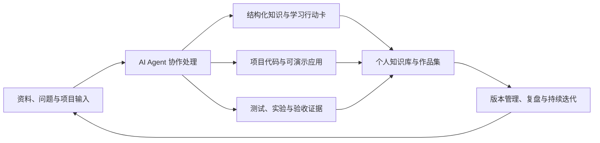

**把 AI 工具链变成稳定的学习、研究与项目交付系统**

---

## 当前定位

我正在把 AI Agent、Obsidian 知识库、研究资料和项目交付流程串成一套可复用的个人工程系统。

<table>
  <tr>
    <td width="33%">
      <b>知识库工程化</b> 
      学习笔记、研究资料、项目代码和交付材料统一归档；近期将 24 个月计划拆成知识点、练习与验收证据。
    </td>
    <td width="33%">
      <b>手语无障碍原型</b> 
      围绕“中文/语音 ↔ 手语视频/识别”做双向闭环，持续验证 GPU 部署、WebSocket 流式输出、ASR 与人工确认。
    </td>
    <td width="33%">
      <b>AI 应用可靠性</b> 
      把增量索引、预传输去重、断点恢复、运行历史与更新报告纳入双网盘自动化系统的工程实践。
    </td>
  </tr>
</table>

---

## 技术栈

---

## 代表项目

| 项目 | 最近做了什么 | 技术栈 |
| --- | --- | --- |
| **xcf-personal-knowledge-base** | 搭建 Obsidian 个人知识库工程：统一归档学习、研究、代码与交付材料；近期完成 24 篇月度知识点行动卡、知识点地图和 Markdown 打卡入口，并持续完善 Agent 规范与公开同步边界。 | Markdown · Obsidian · Git · Claude Code · Codex |
| **sign-language-accessibility-system** | 构建双向实时手语无障碍沟通原型：中文/语音输入 -> 真人手语视频与骨架展示；手语视频 -> 中文识别与 TTS。近期围绕 GPU Compose、FastAPI/WebSocket、流式 partial/final、ASR 和人工确认完成工程化验证。 | Python · PySide6 · FastAPI · OpenCV · MediaPipe · PyTorch |
| **cloud-drive-auto-save** | 构建百度/夸克双网盘自动保存系统，围绕增量索引、自然编号去重、断点续跑、运行历史、WebUI 与报告链路做可靠性建设；近期补齐 V2 控制面、Provider lane、报告引用持久化与发布门禁。 | Python · Flask · Docker Compose · SQLite · WebUI |
| **market-research-automation** | 搭建行业研究流水线：多源市场数据采集 -> 估值/财报/资金流/技术指标/风险定价输出 -> 10 章报告 -> HTML/PDF 发布产物。 | Python · yfinance · AkShare · Playwright |
| **LangChain-RAG-FastAPI-Service** | 基于 LangChain + FastAPI 构建 RAG 知识库 API 服务，围绕向量检索和接口化知识查询做工程实践。 | Python · LangChain · FastAPI · Chroma |
| **Agent-Rag-project** | 探索多 Agent 协作、工具编排和向量检索结合的 RAG 工作流。 | Python · LangChain · Agent |

> 主知识库为私有仓库，这里只展示项目级概览。

---

## 我的工作流

---

## 最近进展

### 2026.08 - 手语无障碍原型的工程化验证

- 在当前发布版中完成一轮本地 GPU Compose 运行链路验证，覆盖 CUDA、FastAPI、ASR、页面状态和 `/ws/sign` 流式识别；演示样例按 212 帧处理，并保留 partial/final 与人工确认边界。
- 持续收敛实时输出、流末补帧、首字响应和最终结果一致性，让“能演示”逐步变成“可解释、可复现、可验收”。
- 将实验记录与质量门禁材料整理成可追溯证据，并继续补齐稳定前缀/动态分块的流式证据链；当前定位仍是竞赛展示与试点前的工程原型，不把演示结果包装成客户效果。

### 2026.08 - AI 应用工程化与可靠性建设

- 将百度与夸克自动保存能力按统一 Compose/WebUI、配置、运行历史和报告链路组织起来，围绕增量索引、自然编号去重与断点续跑持续完善。
- 把回滚点、失败恢复、状态可观测性和“测试通过不等于生产完成”的验收边界纳入工程流程，作为后续 AI 应用与 Agent 系统学习的实践锚点。
- 当前项目处于受控停机和持续验收阶段，仍需补齐真实运行中的异常恢复与全链路生产证据。

### 2026.08 - 网盘自动化 V2 运行时回归

- 在与旧生产树隔离的 V2 环境中完成 final58 回归：Python 测试 `281 passed, 2 skipped`，并通过前端单元测试、浏览器测试、构建和 Compose 静态配置检查。
- 将 Provider lane、shadow/canary 门禁、checkpoint/observation 事实和报告 outbox 纳入可追溯运行链路；报告外部 `delivery_ref` 已通过 0015 migration 持久化，重启后仍可读取。
- 保持证据边界：本轮未调用真实 Provider、未写入真实网盘、未发送真实报告；真实 canary、恰好一次投递、七天观察和可回滚切换仍待授权。

### 2026.08 - 24 个月学习与作品集系统

- 将 24 篇月度行动卡扩展为可直接学习的知识文档：每篇包含基础概念、四周任务、独立练习、验收证据、风险和复盘。
- 增加总计划知识点地图、24 条 Markdown 打卡项以及 2x 高清 HTML/PNG 知识点图表，把长期学习计划连接到具体项目和可复现证据。
- 明确作品集叙事的最低标准：说明问题、实现机制、验证方法、失败边界和个人贡献，而不只罗列项目链接。

### 2026.07 - 双向手语无障碍沟通系统 GUI

- 完成一个可演示的 **PySide6 桌面端应用**：支持中文/语音输入、手语视频展示、骨架同步和手语视频识别。
- 将已有的检索与识别能力封装为桌面端可调用的服务层，减少演示环境依赖。
- 拆分输入、候选、检索解释、舞台展示、反向识别等面板，让界面逻辑更清楚。
- 使用异步任务处理检索、语音识别、视频识别和转码，避免 GUI 主线程卡顿。
- 整理阶段性汇报材料，用于说明系统架构、GUI 贡献和后续优化方向。

### 2026.07 - 个人知识库同步与治理

- 重新整理知识库说明，明确学习资料、研究资料、项目代码和交付材料的边界。
- 清理临时生成产物，把最终交付材料迁移到正式归档位置。
- 完善 GitHub 同步策略：公开仓库只保留适合展示的内容，敏感文件、本地环境、依赖缓存和大文件不进入版本库。
- 明确 Profile 仓库与主知识库仓库独立维护，避免不同项目的 Git 历史混在一起。

### 2026.06-07 - AI Agent 与行业研究自动化

- 使用 Claude Code / Codex 管理素材摄入、笔记生成、图表归档、README/索引同步和交付产物迁移。
- 搭建行业研究工作流，覆盖多源数据采集、行业横向对比、10 章报告、ABCDE 评级和 HTML/PDF 发布产物。
- 积累并使用多类 Skills：PPT 生成、行业报告、文档转换、网页文章、图像生成、前端设计和知识库检索。

---

## 当前重点

| 方向 | 当前状态 |
| --- | --- |
| AI Agent / 工程化 | 工具、状态、验证、边界与安全停止 |
| 知识库 / 学习系统 | 24 个月计划、24 篇行动卡与作品集证据 |
| 手语无障碍原型 | 双向实时链路、GPU 部署与流式识别 |
| 网盘自动化 | V2 控制面、Provider lane、去重、断点恢复与报告门禁 |
| RAG / LangChain | 本地服务、向量检索与 Agent 工作流 |
| 研究自动化 | 多源数据、行业对比与 HTML/PDF 报告 |

---

**持续把学习、研究和工程实践沉淀成可复用、可验证的系统。**

